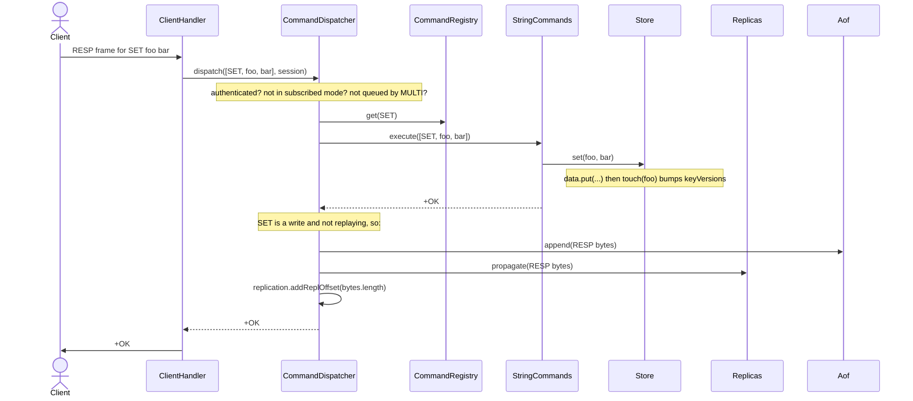
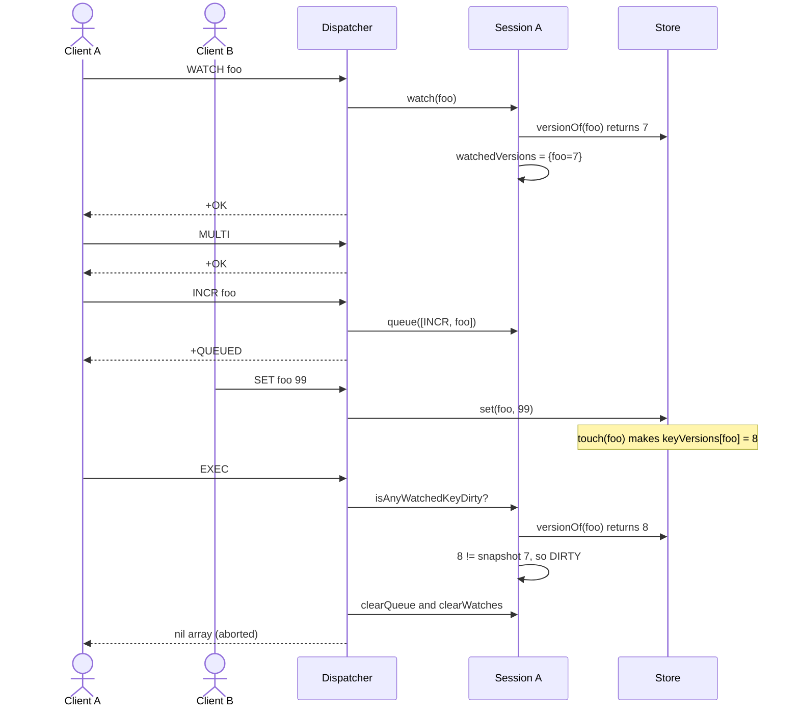

# Architecture

Component ownership, threading, and the main request flows. For the
stage-by-stage "what & why" see [`revision.md`](revision.md).

## The one-paragraph version

`RedisServer.start()` builds **one** of everything shared: a `Database` (four
keyspaces), a `CommandDispatcher` (which builds **one** `CommandRegistry`), and
the server-wide services — `Replicas`, `PubSub`, `DefaultUser`, `ReplicationInfo`,
`Aof`. It loads any RDB file, replays the AOF, optionally starts a
`ReplicationClient` (if `--replicaof`), then runs an accept loop. Every accepted
socket gets its own thread running a `ClientHandler`, and each `ClientHandler`
owns **one** `ClientSession` (its MULTI / queue / WATCH / subscription / auth
state). The handler is a thin loop: `RespParser` turns bytes into `List<String>`,
`dispatcher.dispatch()` turns that into a `byte[]` reply, the handler writes it
back. The dispatcher handles the connection-scoped verbs itself and forwards
every data command to a `Command` looked up by name in the registry.

## Who owns what

| Object | Lifetime | Count | Holds / does |
|---|---|---|---|
| `Database` | server | 1 | `Store` (strings/bitmaps), `ListStore`, `StreamStore`, `SortedSetStore` |
| `CommandDispatcher` | server | 1 | routes commands; owns connection-scoped verbs (MULTI/EXEC/WATCH/SUBSCRIBE/AUTH…) |
| `CommandRegistry` | server | 1 | `Map<String, Command>` (name → handler), assembled from the `CommandGroup`s |
| `Replicas` | server | 1 | replica links + their acked offsets; `propagate()`, `waitForAcks()` |
| `PubSub` | server | 1 | `Map<channel, Set<ClientSession>>`; `publish()` |
| `ReplicationInfo` | server | 1 | role, replid, `master_repl_offset` |
| `DefaultUser` | server | 1 | `nopass` flag + SHA-256 password hashes |
| `Aof` | server | 1 | append-only file; `append()`, `replay()`, `isReplaying()` |
| `Rdb` | server | 1 | `dir` / `dbfilename` config |
| `ClientHandler` | connection | N (1 thread each) | socket; read → dispatch → write loop |
| `ClientSession` | connection | N | `inMulti`, `commandQueue`, `watchedVersions`, `channels`, `authenticated` |
| `ReplicationClient` | server (slave only) | 0 or 1 | daemon thread: handshake, RDB, apply master's command stream |

## Threading

| State | Thread-safety | Why |
|---|---|---|
| `ClientSession` | none | only its own handler thread touches it |
| `ListStore` / `StreamStore` / `SortedSetStore` | `synchronized` lock | many client threads |
| `Store.keyVersions` | `ConcurrentHashMap` | WATCH check races with writers |
| `Store.data` / `expiry` | plain `HashMap` — **known gap**, not hit by the tests | — |
| `PubSub.byChannel` | `ConcurrentHashMap` + `newKeySet()` | subscribe/publish across threads |
| `Replicas.handles` | `CopyOnWriteArrayList` | rare writes, frequent iteration |
| `ReplicationInfo.replOffset` | `volatile` | written by writers, read by WAIT |
| `DefaultUser` | all methods `synchronized` | shared, mutated by any client thread |
| socket `OutputStream` | `synchronized(out)` | handler replies + PUBLISH deliver + replica propagate all write it |

## Request flow (normal command)



## Transaction flow (MULTI / EXEC / WATCH)

The dispatcher special-cases the verbs *before* touching the registry:

- **MULTI** → `session.beginMulti()`
- **WATCH k...** → for each key `session.watch(k)`, which snapshots
  `Store.versionOf(k)` into `watchedVersions`
- **UNWATCH** → `session.clearWatches()`
- **DISCARD** → drop queue + watches, leave MULTI
- **EXEC** →
  1. not in MULTI → `-ERR EXEC without MULTI`
  2. any watched key whose current `Store.versionOf()` ≠ the snapshot → clear
     everything, return `*-1\r\n` (nil)
  3. otherwise `drainQueue()` and `dispatch()` each queued command
     **recursively**, concatenating the replies behind `*<n>\r\n`

While `inMulti`, any command that is *not* EXEC / DISCARD / WATCH is queued and
answered `+QUEUED`.



### Why WATCH works across threads without callbacks

`Store` keeps a monotonic counter per key:

```
ConcurrentHashMap<String, Long> keyVersions;
touch(key)      -> keyVersions.merge(key, 1L, Long::sum);   // every set()/increment()/load()
versionOf(key)  -> keyVersions.getOrDefault(key, 0L);
```

`WATCH` records `(key -> version)` on the watching connection; `EXEC` re-reads and
compares. The only cross-thread state is a concurrent map of longs — no
`volatile` flag, and `Store` holds no reference back to a `ClientHandler`. The
first design (a callback from `Store` into the handler + a `volatile` dirty flag)
is gone.

## Replication flow

```mermaid
sequenceDiagram
    participant RC as ReplicationClient (replica)
    participant M as Master (ClientHandler)
    participant RP as Replicas
    participant CD as Dispatcher (replica side)

    RC->>M: PING / REPLCONF listening-port / REPLCONF capa
    M-->>RC: +PONG / +OK / +OK
    RC->>M: PSYNC ? -1
    M-->>RC: +FULLRESYNC <replid> 0
    M-->>RC: $<len>\r\n<empty RDB bytes>
    Note over M: register this socket as a Replicas.Handle (inside synchronized(out))

    Note over RC: consume RDB, then in.resetCount()

    M->>RP: propagate(SET foo bar)  (from some client's write)
    RP->>RC: SET foo bar
    RC->>CD: dispatch([SET,foo,bar]) — reply discarded

    M->>RP: WAIT triggers propagate(REPLCONF GETACK *)
    RP->>RC: REPLCONF GETACK *
    RC->>M: REPLCONF ACK <bytes before this GETACK>
    Note over RP: recordAck → notify; waitForAcks counts offsets >= target
```

Replica offset = bytes read off the post-RDB command stream, counted by a
`CountingInputStream` and sampled **before** each frame, so `REPLCONF ACK` reports
"processed before this GETACK".

## Persistence

- **RDB (read only):** `RdbReader.loadInto(path, stringStore)` at startup. Parses
  header + the opcodes the spec uses (`FA`/`FE`/`FB`/`FC`/`FD`) + string values;
  throws on anything else.
- **AOF:** `Aof.open()` lays out `appendonlydir/` and finds the active
  `type i` file from the manifest. Write commands are RESP-appended after
  execution (`SYNC` before return when `appendfsync always`). `Aof.replay()`
  feeds the file back through `dispatch()` at startup under a `replaying` flag
  that suppresses re-append + propagation.

## Pub/Sub

`SUBSCRIBE`/`UNSUBSCRIBE` update `ClientSession.channels` and register in the
server-wide `PubSub`. `PUBLISH` builds one `message` array and calls
`subscriber.deliver()` — a cross-thread write to each subscriber's socket, guarded
by `synchronized(connection)`, the same monitor `ClientHandler` uses for that
socket's own replies. In subscribed mode only SUBSCRIBE/UNSUBSCRIBE/PING/QUIT/
RESET (+ pattern variants) are allowed.

## Auth

`DefaultUser` starts `nopass`. `ACL SETUSER default >pw` stores `SHA-256(pw)` and
clears it. `ClientSession.authenticated` is seeded from `user.nopass()` when the
connection opens, so a password locks out **new** connections without dropping
existing ones. `dispatch()` returns `-NOAUTH Authentication required.` for every
command except `AUTH` on an unauthenticated session. `AUTH` lives in the
dispatcher (not a command group) because it needs `session.authenticate()`.

## Adding a command later

1. Pick the group (`StringCommands`, `ListCommands`, …) or add a new
   `CommandGroup` subclass.
2. `add("NAME", args -> { ... return RespEncoder.xxx(...); });`
3. If it's a new group, `register(new XxxCommands(...))` in `CommandRegistry`.
4. If it mutates data and must replicate, add its name to
   `CommandDispatcher.WRITE_COMMANDS`.

Connection-scoped commands (SUBSCRIBE, transaction verbs, AUTH, replication
handshake) go in `CommandDispatcher`, where the `ClientSession` is in scope.

## Diagrams

The sequence diagrams above are Mermaid — they render inline on GitHub and in
most Markdown viewers.

The class diagram is PlantUML in [`classes.puml`](classes.puml) (Graphviz-free —
`!pragma layout smetana`). Render with `plantuml docs/classes.puml` or paste into
<https://www.plantuml.com/plantuml>.
