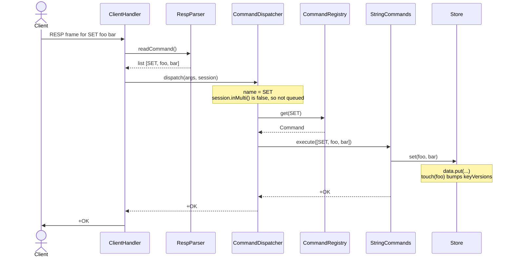
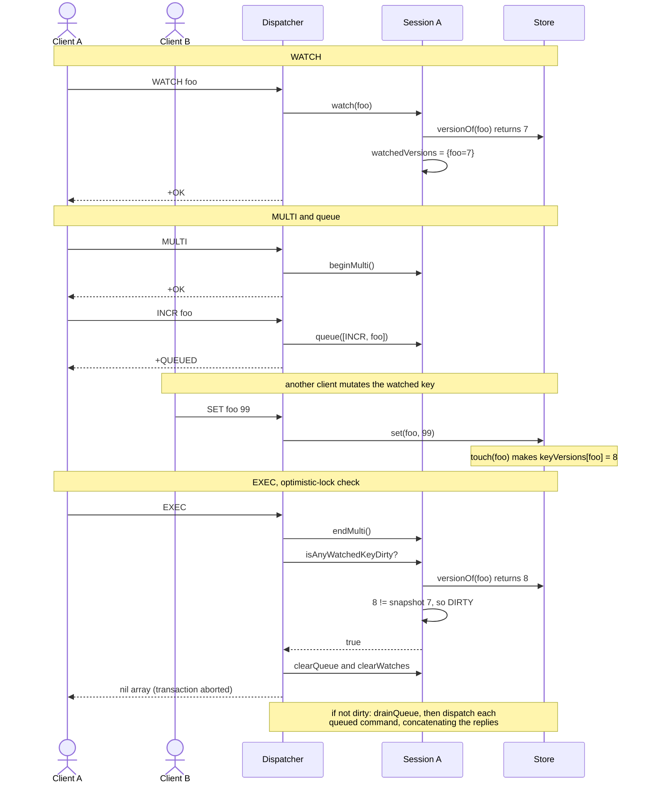

# Architecture — after the command-dispatch refactor

## The one-paragraph version

`RedisServer` builds **one** `Database` (the three keyspaces) and **one**
`CommandDispatcher` (which builds **one** `CommandRegistry`). Every accepted
socket gets its own thread running a `ClientHandler`, and each `ClientHandler`
owns **one** `ClientSession` (its MULTI / queue / WATCH state). The handler is a
thin loop: `RespParser` turns bytes into `List<String>`, `dispatcher.dispatch()`
turns that into a `byte[]` reply, the handler writes it back. The dispatcher
handles the transaction verbs itself and forwards everything else to a `Command`
looked up by name in the registry.

## Who owns what

| Object | Lifetime | Count | Holds |
|---|---|---|---|
| `Database` | server | 1 | `Store`, `ListStore`, `StreamStore` |
| `CommandDispatcher` | server | 1 | `Database`, `CommandRegistry` |
| `CommandRegistry` | server | 1 | `Map<String, Command>` (name → handler) |
| `ClientHandler` | connection | N (1 thread each) | socket, dispatcher ref, its session |
| `ClientSession` | connection | N | `inMulti`, `commandQueue`, `watchedVersions` |

Shared, mutated by many threads: the three stores. They serialize internally
(`ListStore` / `StreamStore` use a `synchronized` lock; `Store.keyVersions` is a
`ConcurrentHashMap`). `ClientSession` is touched by only its own thread, so it
needs no locking.

## Request flow (normal command)



## Transaction flow (MULTI / EXEC / WATCH)

The dispatcher special-cases five verbs *before* touching the registry:

- **MULTI** → `session.beginMulti()`
- **WATCH k...** → for each key `session.watch(k)`, which snapshots
  `Store.versionOf(k)` into `watchedVersions`
- **UNWATCH** → `session.clearWatches()`
- **DISCARD** → drop queue + watches, leave MULTI
- **EXEC** →
  1. not in MULTI → `-ERR EXEC without MULTI`
  2. `session.isAnyWatchedKeyDirty()` — any watched key whose current
     `Store.versionOf()` ≠ the snapshot → clear everything, return `*-1\r\n` (nil)
  3. otherwise: `drainQueue()`, and for each queued command call
     `dispatch()` **recursively**, concatenating the replies behind `*<n>\r\n`

While `inMulti` is true, any command that is *not* EXEC / DISCARD / WATCH is
appended to the queue and answered with `+QUEUED`.



## Why WATCH works across threads without callbacks

`Store` keeps a monotonic counter per key:

```
ConcurrentHashMap<String, Long> keyVersions;
touch(key)  -> keyVersions.merge(key, 1L, Long::sum);   // called by every set()/increment()
versionOf(key) -> keyVersions.getOrDefault(key, 0L);
```

`WATCH` records `(key -> version)` on the watching connection. `EXEC` re-reads
`versionOf` and compares. The only cross-thread state is a concurrent map of
longs — no `volatile` flag, and `Store` never holds a reference back to a
`ClientHandler`. That circular dependency (and the callback that forced the
`volatile`) is gone.

## Adding a command later

1. Pick the group (`StringCommands`, `ListCommands`, …) or add a new
   `CommandGroup` subclass.
2. `add("NAME", args -> { ... return RespEncoder.xxx(...); });`
3. If it's a new group, `register(new XxxCommands(...))` in `CommandRegistry`.

Connection-scoped commands (SUBSCRIBE, transaction verbs, replication
handshake) instead go in `CommandDispatcher`, where the `ClientSession` is in
scope.

## Diagrams

The two sequence diagrams above are Mermaid — they render inline on GitHub and in
most Markdown viewers, no tooling needed.

The class diagram is PlantUML in [`classes.puml`](classes.puml) (Graphviz-free —
it uses `!pragma layout smetana`). Render it with:

```
plantuml docs/classes.puml      # produces docs/classes.png
```

or paste it into <https://www.plantuml.com/plantuml>.